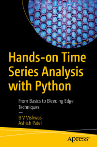

# Apress Source Code

This repository accompanies [*Hands-on Time Series Analysis with Python*](https://www.apress.com/9781484259917) by B V Vishwas and Ashish Patel (Apress, 2020).

[comment]: #cover


Download the files as a zip using the green button, or clone the repository to your machine using Git.

#### Installation

```
 pip install -r requirements.txt
```

####  Chapter-1: Time-Series Characteristics

| Topic                                  | Notebook                                                     | Colab                                                        |
| -------------------------------------- | ------------------------------------------------------------ | ------------------------------------------------------------ |
| 1.Trend                                | [Github](https://github.com/Apress/hands-on-time-series-analylsis-python/blob/master/Chapter%201/1.Trend.ipynb) | [](https://colab.research.google.com/github/Apress/hands-on-time-series-analylsis-python/blob/master/Chapter%201/1.Trend.ipynb) |
| 2.Detrending using Differencing        | [Github](https://github.com/Apress/hands-on-time-series-analylsis-python/blob/master/Chapter%201/2.Detrending%20using%20Differencing.ipynb) | [](https://colab.research.google.com/github/Apress/hands-on-time-series-analylsis-python/blob/master/Chapter%201/2.Detrending%20using%20Differencing.ipynb) |
| 3.Detrending using Scipy Signal        | [Github](https://github.com/Apress/hands-on-time-series-analylsis-python/blob/master/Chapter%201/3.Detrending%20using%20Scipy%20Signal.ipynb) | [](https://colab.research.google.com/github/Apress/hands-on-time-series-analylsis-python/blob/master/Chapter%201/3.Detrending%20using%20Scipy%20Signal.ipynb) |
| 4.Detrending using HP Filter           | [Github](https://github.com/Apress/hands-on-time-series-analylsis-python/blob/master/Chapter%201/4.Detrending%20using%20HP%20Filter.ipynb) | [](https://colab.research.google.com/github/Apress/hands-on-time-series-analylsis-python/blob/master/Chapter%201/4.Detrending%20using%20HP%20Filter.ipynb) |
| 5.Multi Month-wise Box Plot            | [Github](https://github.com/Apress/hands-on-time-series-analylsis-python/blob/master/Chapter%201/5.Multi%20Month-wise%20Box%20Plot.ipynb) | [](https://colab.research.google.com/github/Apress/hands-on-time-series-analylsis-python/blob/master/Chapter%201/5.Multi%20Month-wise%20Box%20Plot.ipynb) |
| 6.Autocorrelation plot for seasonality | [Github](https://github.com/Apress/hands-on-time-series-analylsis-python/blob/master/Chapter%201/6.Autocorrelation%20plot%20for%20seasonality.ipynb) | [](https://colab.research.google.com/github/Apress/hands-on-time-series-analylsis-python/blob/master/Chapter%201/6.Autocorrelation%20plot%20for%20seasonality.ipynb) |
| 7.Deseasoning Time series              | [Github](https://github.com/Apress/hands-on-time-series-analylsis-python/blob/master/Chapter%201/7.Deseasoning%20Time%20series.ipynb) | [](https://colab.research.google.com/github/Apress/hands-on-time-series-analylsis-python/blob/master/Chapter%201/7.Deseasoning%20Time%20series.ipynb) |
| 8.Detecting cyclical variation         | [Github](https://github.com/Apress/hands-on-time-series-analylsis-python/blob/master/Chapter%201/8.Detecting%20cyclical%20variation.ipynb) | [](https://colab.research.google.com/github/Apress/hands-on-time-series-analylsis-python/blob/master/Chapter%201/8.Detecting%20cyclical%20variation.ipynb) |
| 9.Decompose Time series                | [Github](https://github.com/Apress/hands-on-time-series-analylsis-python/blob/master/Chapter%201/9.Decompose%20Time%20series.ipynb) | [](https://colab.research.google.com/github/Apress/hands-on-time-series-analylsis-python/blob/master/Chapter%201/9.Decompose%20Time%20series.ipynb) |

---

#### Chapter-2: Data Wrangling and Preparation for Time Series

| Topic                                    | Notebook                                                     | Colab                                                        |
| ---------------------------------------- | ------------------------------------------------------------ | ------------------------------------------------------------ |
| Data wrangling using pandas and pandasql | [Github](https://github.com/Apress/hands-on-time-series-analylsis-python/blob/master/Chapter%202/Data%20wrangling%20using%20pandas%20and%20pandasql.ipynb) | [](https://colab.research.google.com/github/Apress/hands-on-time-series-analylsis-python/blob/master/Chapter%202/Data%20wrangling%20using%20pandas%20and%20pandasql.ipynb) |

---

#### Chapter-3: Smoothing Methods

| Topic                           | Notebook                                                     | Colab                                                        |
| ------------------------------- | ------------------------------------------------------------ | ------------------------------------------------------------ |
| 1. Simple exponential smoothing | [Github](https://github.com/Apress/hands-on-time-series-analylsis-python/blob/master/Chapter%203/1.%20Simple%20exponential%20smoothing.ipynb) | [](https://colab.research.google.com/github/Apress/hands-on-time-series-analylsis-python/blob/master/Chapter%203/1.%20Simple%20exponential%20smoothing.ipynb) |
| 2. Double Exponential Smoothing | [Github](https://github.com/Apress/hands-on-time-series-analylsis-python/blob/master/Chapter%203/2.%20Double%20Exponential%20Smoothing%20.ipynb) | [](https://colab.research.google.com/github/Apress/hands-on-time-series-analylsis-python/blob/master/Chapter%203/2.%20Double%20Exponential%20Smoothing.ipynb) |
| 3. Triple Exponential Smoothing | [Github](https://github.com/Apress/hands-on-time-series-analylsis-python/blob/master/Chapter%203/3.%20Triple%20Exponential%20Smoothing.ipynb) | [](https://colab.research.google.com/github/Apress/hands-on-time-series-analylsis-python/blob/master/Chapter%203/3.%20Triple%20Exponential%20Smoothing.ipynb) |

---

#### Chapter-4: Regression Extension Techniques for Time- Series Data

| Topic                     | Notebook                                                     | Colab                                                        |
| ------------------------- | ------------------------------------------------------------ | ------------------------------------------------------------ |
| 1. AR and MA              | [Github](https://github.com/Apress/hands-on-time-series-analylsis-python/blob/master/Chapter%204/1.%20AR%20and%20MA.ipynb) | [](https://colab.research.google.com/github/Apress/hands-on-time-series-analylsis-python/blob/master/Chapter%204/1.%20AR%20and%20MA.ipynb) |
| 2. Stationary             | [Github](https://github.com/Apress/hands-on-time-series-analylsis-python/blob/master/Chapter%204/2.%20Stationary.ipynb) | [](https://colab.research.google.com/github/Apress/hands-on-time-series-analylsis-python/blob/master/Chapter%204/2.%20Stationary.ipynb) |
| 3. ARIMA                  | [Github](https://github.com/Apress/hands-on-time-series-analylsis-python/blob/master/Chapter%204/3.%20ARIMA.ipynb) | [](https://colab.research.google.com/github/Apress/hands-on-time-series-analylsis-python/blob/master/Chapter%204/3.%20ARIMA.ipynb) |
| 4. SARIMA                 | [Github](https://github.com/Apress/hands-on-time-series-analylsis-python/blob/master/Chapter%204/4.%20SARIMA.ipynb) | [](https://colab.research.google.com/github/Apress/hands-on-time-series-analylsis-python/blob/master/Chapter%204/4.%20SARIMA.ipynb) |
| 5. SARIMAX                | [Github](https://github.com/Apress/hands-on-time-series-analylsis-python/blob/master/Chapter%204/5.%20SARIMAX.ipynb) | [](https://colab.research.google.com/github/Apress/hands-on-time-series-analylsis-python/blob/master/Chapter%204/5.%20SARIMAX.ipynb) |
| 6. VAR                    | [Github](https://github.com/Apress/hands-on-time-series-analylsis-python/blob/master/Chapter%204/6.%20VAR.ipynb) | [](https://colab.research.google.com/github/Apress/hands-on-time-series-analylsis-python/blob/master/Chapter%204/6.%20VAR.ipynb) |
| 7. VARMA with Auto Arima  | [Github](https://github.com/Apress/hands-on-time-series-analylsis-python/blob/master/Chapter%204/7.%20VARMA%20with%20Auto%20Arima.ipynb) | [](https://colab.research.google.com/github/Apress/hands-on-time-series-analylsis-python/blob/master/Chapter%204/7.%20VARMA%20with%20Auto%20Arima.ipynb) |
| 8. VARMA with Gird Search | [Github](https://github.com/Apress/hands-on-time-series-analylsis-python/blob/master/Chapter%204/8.%20VARMA%20with%20Gird%20Search.ipynb) | [](https://colab.research.google.com/github/Apress/hands-on-time-series-analylsis-python/blob/master/Chapter%204/8.%20VARMA%20with%20Gird%20Search.ipynb) |

---

#### Chapter-5: Bleeding-Edge Techniques

This chapter contains deep learning theory.

---

#### Chapter-6: Bleeding-Edge Techniques for Univariate Time Series

| Topic                                                | Notebook                                                     | Colab                                                        |
| ---------------------------------------------------- | ------------------------------------------------------------ | ------------------------------------------------------------ |
| 1. Bidirectional LSTM Univarient Single Step Style   | [Github](https://github.com/Apress/hands-on-time-series-analylsis-python/blob/master/Chapter%206/1.%20Bidirectional%20LSTM%20Univarient%20Single%20Step%20Style.ipynb) | [](https://colab.research.google.com/github/Apress/hands-on-time-series-analylsis-python/blob/master/Chapter%206/1.%20Bidirectional%20LSTM%20Univarient%20Single%20Step%20Style.ipynb) |
| 2. Bidirectional LSTM Univarient Horizon Style       | [Github](https://github.com/Apress/hands-on-time-series-analylsis-python/blob/master/Chapter%206/2.%20Bidirectional%20LSTM%20Univarient%20Horizon%20Style.ipynb) | [](https://colab.research.google.com/github/Apress/hands-on-time-series-analylsis-python/blob/master/Chapter%206/2.%20Bidirectional%20LSTM%20Univarient%20Horizon%20Style.ipynb) |
| 3. CNN Univarient Horizon Style                      | [Github](https://github.com/Apress/hands-on-time-series-analylsis-python/blob/master/Chapter%206/3.%20CNN%20Univarient%20Horizon%20Style.ipynb) | [](https://colab.research.google.com/github/Apress/hands-on-time-series-analylsis-python/blob/master/Chapter%206/3.%20CNN%20Univarient%20Horizon%20Style.ipynb) |
| 4. CNN Univarient Single Step Style                  | [Github](https://github.com/Apress/hands-on-time-series-analylsis-python/blob/master/Chapter%206/4.%20CNN%20Univarient%20Single%20Step%20Style.ipynb) | [](https://colab.research.google.com/github/Apress/hands-on-time-series-analylsis-python/blob/master/Chapter%206/4.%20CNN%20Univarient%20Single%20Step%20Style.ipynb) |
| 5. Encoder Decoder LSTM Univariate Horizon Style     | [Github](https://github.com/Apress/hands-on-time-series-analylsis-python/blob/master/Chapter%206/5.%20Encoder%20Decoder%20LSTM%20Univariate%20%20Horizon%20Style.ipynb) | [](https://colab.research.google.com/github/Apress/hands-on-time-series-analylsis-python/blob/master/Chapter%206/5.%20Encoder%20Decoder%20LSTM%20Univariate%20%20Horizon%20Style.ipynb)|
| 6. Encoder Decoder LSTM Univarient Single Step Style | [Github](https://github.com/Apress/hands-on-time-series-analylsis-python/blob/master/Chapter%206/6.%20Encoder%20Decoder%20LSTM%20Univarient%20Single%20Step%20Style.ipynb) | [](https://colab.research.google.com/github/Apress/hands-on-time-series-analylsis-python/blob/master/Chapter%206/6.%20Encoder%20Decoder%20LSTM%20Univarient%20Single%20Step%20Style.ipynb) |
| 7. GRU Univarient Single Step Style                  | [Github](https://github.com/Apress/hands-on-time-series-analylsis-python/blob/master/Chapter%206/7.%20GRU%20Univarient%20Single%20Step%20Style.ipynb) | [](https://colab.research.google.com/github/Apress/hands-on-time-series-analylsis-python/blob/master/Chapter%206/7.%20GRU%20Univarient%20Single%20Step%20Style.ipynb) |
| 8. GRU Univarient Horizon Style                      | [Github](https://github.com/Apress/hands-on-time-series-analylsis-python/blob/master/Chapter%206/8.%20GRU%20Univarient%20Horizon%20Style.ipynb) | [](https://colab.research.google.com/github/Apress/hands-on-time-series-analylsis-python/blob/master/Chapter%206/8.%20GRU%20Univarient%20Horizon%20Style.ipynb) |
| 9. LSTM Univariate Horizon Style                     | [Github](https://github.com/Apress/hands-on-time-series-analylsis-python/blob/master/Chapter%206/9.%20LSTM%20Univariate%20Horizon%20Style.ipynb)| [](https://colab.research.google.com/github/Apress/hands-on-time-series-analylsis-python/blob/master/Chapter%206/9.%20LSTM%20Univariate%20Horizon%20Style.ipynb) |
| 10. LSTM Univarient Single Step Style                | [Github](https://github.com/Apress/hands-on-time-series-analylsis-python/blob/master/Chapter%206/10.%20LSTM%20Univarient%20Single%20Step%20Style.ipynb) | [](https://colab.research.google.com/github/Apress/hands-on-time-series-analylsis-python/blob/master/Chapter%206/10.%20LSTM%20Univarient%20Single%20Step%20Style.ipynb)|

---

#### Chapter-7: Bleeding-Edge Techniques for Multivariate Time Series

| Topic                                              | Notebook                                                     | Colab                                                        |
| -------------------------------------------------- | ------------------------------------------------------------ | ------------------------------------------------------------ |
| 1. Bidirectional LSTM Multivariate Horizon Style   | [Github](https://github.com/Apress/hands-on-time-series-analylsis-python/blob/master/Chapter%207/1.%20Bidirectional%20LSTM%20Multivariate%20Horizon%20Style.ipynb) | [](https://colab.research.google.com/github/Apress/hands-on-time-series-analylsis-python/blob/master/Chapter%207/1.%20Bidirectional%20LSTM%20Multivariate%20Horizon%20Style.ipynb) |
| 2. CNN Multivariate Horizon Style                  | [Github](https://github.com/Apress/hands-on-time-series-analylsis-python/blob/master/Chapter%207/2.%20CNN%20Multivariate%20Horizon%20Style.ipynb) | [](https://colab.research.google.com/github/Apress/hands-on-time-series-analylsis-python/blob/master/Chapter%207/2.%20CNN%20Multivariate%20Horizon%20Style.ipynb) |
| 3. Encoder Decoder LSTM Multivariate Horizon Style | [Github](https://github.com/Apress/hands-on-time-series-analylsis-python/blob/master/Chapter%207/3.%20Encoder%20Decoder%20LSTM%20Multivariate%20Horizon%20Style.ipynb) | [](https://colab.research.google.com/github/Apress/hands-on-time-series-analylsis-python/blob/master/Chapter%207/3.%20Encoder%20Decoder%20LSTM%20Multivariate%20Horizon%20Style.ipynb) |
| 4. GRU Multivariate Horizon Style                  | [Github](https://github.com/Apress/hands-on-time-series-analylsis-python/blob/master/Chapter%207/4.%20GRU%20Multivariate%20Horizon%20Style.ipynb)| [](https://colab.research.google.com/github/Apress/hands-on-time-series-analylsis-python/blob/master/Chapter%207/4.%20GRU%20Multivariate%20Horizon%20Style.ipynb) |
| 5. LSTM Multivariate Horizon Style                 | [Github](https://github.com/Apress/hands-on-time-series-analylsis-python/blob/master/Chapter%207/5.%20LSTM%20Multivariate%20Horizon%20Style.ipynb)| [](https://colab.research.google.com/github/Apress/hands-on-time-series-analylsis-python/blob/master/Chapter%207/5.%20LSTM%20Multivariate%20Horizon%20Style.ipynb) |

---

#### Chapter-8 : Prophet

| Topic                                         | Notebook                                                     | Colab                                                        |
| --------------------------------------------- | ------------------------------------------------------------ | ------------------------------------------------------------ |
| 1. fbprophet                                  | [Github](https://github.com/Apress/hands-on-time-series-analylsis-python/blob/master/Chapter%208/1.%20fbprophet.ipynb) | [](https://colab.research.google.com/github/Apress/hands-on-time-series-analylsis-python/blob/master/Chapter%208/1.%20fbprophet.ipynb) |
| 2. fbprophet with log transformation          | [Github](https://github.com/Apress/hands-on-time-series-analylsis-python/blob/master/Chapter%208/2.%20fbprophet_with_log_transformation.ipynb) | [](https://colab.research.google.com/github/Apress/hands-on-time-series-analylsis-python/blob/master/Chapter%208/2.%20fbprophet_with_log_transformation.ipynb) |
| 3. fbprophet adding country holiday           | [Github](https://github.com/Apress/hands-on-time-series-analylsis-python/blob/master/Chapter%208/3.%20fbprophet_adding_country_holiday.ipynb) | [](https://colab.research.google.com/github/Apress/hands-on-time-series-analylsis-python/blob/master/Chapter%208/3.%20fbprophet_adding_country_holiday.ipynb) |
| 4. fbprophet with exogenous or add_regressors | [Github](https://github.com/Apress/hands-on-time-series-analylsis-python/blob/master/Chapter%208/4.%20fbprophet_with_exogenous_or_add_regressors.ipynb) | [](https://colab.research.google.com/github/Apress/hands-on-time-series-analylsis-python/blob/master/Chapter%208/4.%20fbprophet_with_exogenous_or_add_regressors.ipynb) |

**Note**: All Jupyter Notebook Sample Data is available in **[Data](https://github.com/Apress/hands-on-time-series-analylsis-python/tree/master/Data)** Folder

---

## Releases

Release v1.0 corresponds to the code in the published book, without corrections or updates.

## Contributions

See the file Contributing.md for more information on how you can contribute to this repository.
